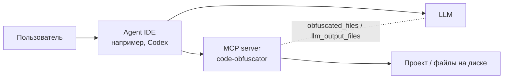
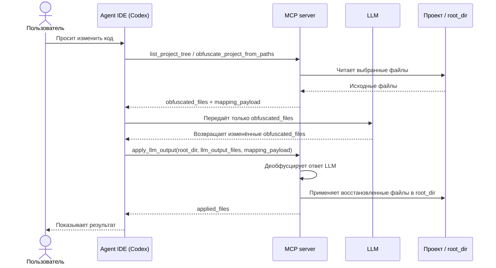

# code-obfuscator

MCP-сервер и CLI для безопасной обфускации кода перед LLM и обратного применения изменений в проект.

## Актуальная модель MCP

По умолчанию сервер экспортирует инструменты:
- `list_project_tree`
- `obfuscate_project_from_paths`
- `obfuscate_project`
- `apply_llm_output`

Прямые инструменты деобфускации (`deobfuscate_project`, `deobfuscate_project_from_paths`) по умолчанию отключены и скрыты из `tools/list`.
Для legacy-совместимости включаются через `MCP_ALLOW_DIRECT_DEOBFUSCATION=true`.

## Быстрый старт

1. Подготовьте mapping (опционально, но рекомендуется):

```json
{
  "business_secret": "bs"
}
```

2. Соберите сервер:

```bash
cargo build --bin mcp-server
# или
make mcp-docker-build
```

3. Запустите MCP по HTTP:

```bash
MCP_HTTP_ADDR=127.0.0.1:18787 \
MCP_DEFAULT_MAPPING_PATH=./mapping.default.json \
./scripts/run-mcp-docker.sh
```

4. Проверьте:

```bash
curl -i http://127.0.0.1:18787/health
curl -i http://127.0.0.1:18787/mapping
```

## Подключение в Codex

### Вариант 1: HTTP

```toml
[mcp_servers.code_obfuscator]
enabled = true
url = "http://127.0.0.1:18787"
```

### Вариант 2: stdio + docker

Важно: если используете `apply_llm_output`, проект должен быть смонтирован как `:rw`.
Для path-based инструментов (`list_project_tree`, `obfuscate_project_from_paths`, `apply_llm_output`) `root_dir` должен быть путём внутри контейнера (например, `/workspace/project`).

```toml
[mcp_servers.code_obfuscator]
enabled = true
command = "docker"
args = [
  "run", "--rm", "-i",
  "-e", "MCP_DEFAULT_MAPPING_PATH=/data/mapping.default.json",
  "-e", "MCP_LOG_STDOUT=false",
  "-v", "/ABS/PATH/mapping.default.json:/data/mapping.default.json:ro",
  "-v", "/ABS/PATH/PROJECT_ROOT:/workspace/project:rw",
  "code-obfuscator-mcp:local"
]
```

## Рекомендуемый workflow с LLM

1. Получить структуру проекта (`list_project_tree`) и выбрать нужные файлы.
2. Обфусцировать вход (`obfuscate_project_from_paths` или `obfuscate_project`).
3. Дать LLM только `obfuscated_files`.
4. Передать результат LLM в `apply_llm_output` с `root_dir`, `llm_output_files` и (опционально) `mapping_payload`. Можно передавать весь набор `obfuscated_files` или только изменённый subset файлов.
5. MCP сам деобфусцирует и применяет файлы на диск.

## Архитектура





Agent IDE выступает оркестратором: принимает запрос пользователя, вызывает MCP-инструменты, передаёт в модель только `obfuscated_files` и затем отправляет результат обратно в `apply_llm_output`.

MCP-сервер изолирует работу с исходным кодом. Он читает файлы проекта, обфусцирует содержимое перед отправкой в LLM, а после ответа модели сам выполняет deobfuscation и запись восстановленных файлов в `root_dir`.

## Контракты инструментов (кратко)

### `list_project_tree`
- Вход: `root_dir`, `max_depth?`, `max_entries?`, `include_hidden?`.
- Выход: `entries[{path,kind}]`, `truncated`.

### `obfuscate_project_from_paths`
- Вход: `root_dir`, `file_paths?`, `manual_mapping?`, `options?`.
- MCP читает файлы с диска и возвращает тот же формат, что `obfuscate_project`.

### `obfuscate_project`
- Вход: `project_files`, `manual_mapping?`, `options?`.
- Выход: `obfuscated_files`, `mapping_payload`, `stats`, `events`.

### `apply_llm_output`
- Вход: `root_dir`, `llm_output_files`, `mapping_payload?`, `options?`.
- MCP делает deobfuscation внутри сервера и пишет восстановленные файлы в `root_dir`. Поддерживается как полный набор файлов, так и subset изменённых файлов из исходного `obfuscated_files`.
- Выход: `applied_files`, `stats`, `events`.
- Приоритет mapping: `mapping_payload` из запроса, иначе server default mapping.

## HTTP endpoints

- `GET /health`
- `GET /mapping`
- `PUT /mapping`
- `POST /` (MCP JSON-RPC)
- `POST /mcp` (MCP JSON-RPC alias)

## Основные переменные окружения

- `MCP_DEFAULT_MAPPING_PATH`
- `MCP_HTTP_ADDR`
- `MCP_LOG_DIR`
- `MCP_LOG_MAX_BYTES`
- `MCP_LOG_MAX_FILES`
- `MCP_LOG_STDOUT`
- `MCP_ALLOW_DIRECT_DEOBFUSCATION` (default: `false`)

## Типовые ошибки и восстановление

- `fail-fast: obfuscated token ... is missing in LLM output for file ...`
  - LLM повредил/удалил обфусцированный токен в возвращаемом файле. Повторите шаг правки, сохранив обфусцированные токены в этом файле.
- `apply_llm_output received unknown file path ...`
  - В `llm_output_files` передан путь, которого не было в исходном `obfuscated_files`. Возвращайте только исходные пути или их subset.
- `root_dir is not writable for apply_llm_output ... Mount the project volume as :rw`
  - Docker volume проекта смонтирован read-only. Для применения изменений используйте `:rw`.

## Разработка

```bash
make build
make test
cargo test --test mcp_server
```
