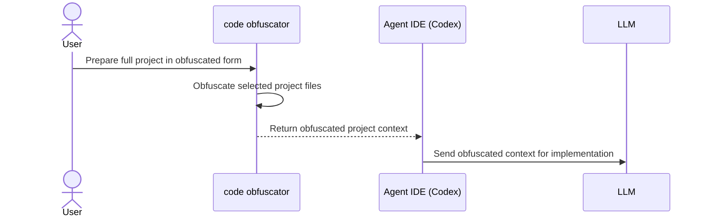
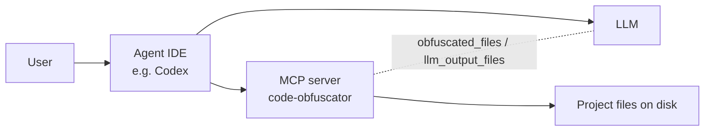
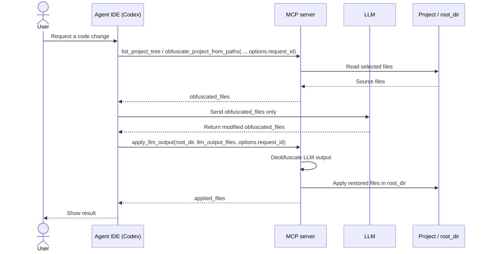

# code-obfuscator

MCP server and CLI/TUI utility for safe code obfuscation before LLM usage and reverse application of LLM changes back to your project.

## Architecture Diagrams

### code obfuscator case



### MCP Case





## CLI Quick Start

### install

```bash
curl -fsSL https://raw.githubusercontent.com/sawrus/code-obfuscator/main/install | CODE_OBFUSCATOR_INSTALL_REPO=sawrus/code-obfuscator bash
```

Binaries are installed from GitHub Releases: [sawrus/code-obfuscator/releases](https://github.com/sawrus/code-obfuscator/releases).

### execute

```bash
code-obfuscator
```

## MCP Quick Start

### build

```bash
make mcp-docker-build
```

### start

```bash
MCP_HTTP_ADDR=127.0.0.1:18787 \
MCP_DEFAULT_MAPPING_PATH=./mapping.default.json \
./scripts/run-mcp-docker.sh
```

### health check

```bash
curl -i http://127.0.0.1:18787/health
```

## Detailed Documentation

- Full documentation (install lifecycle, CLI/TUI modes, MCP integrations, architecture, troubleshooting): [docs/DETAILS.md](docs/DETAILS.md)
- Security and performance: [docs/SECURITY_AND_PERFORMANCE.md](docs/SECURITY_AND_PERFORMANCE.md)
- Samples: [docs/SAMPLES.md](docs/SAMPLES.md)
- MCP server plan: [docs/MCP_SERVER_PLAN.md](docs/MCP_SERVER_PLAN.md)

## Development

```bash
make build
make test
```
