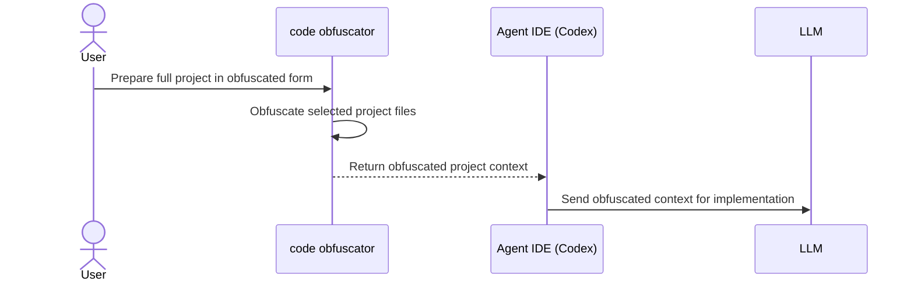
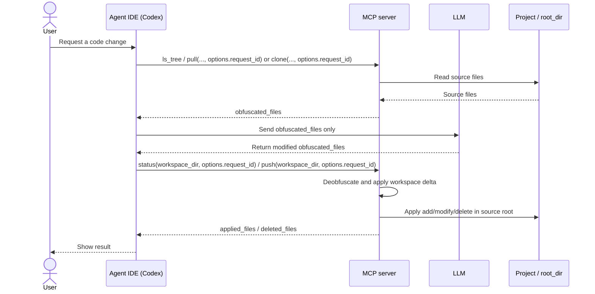

# code-obfuscator

MCP server and CLI/TUI utility for safe code obfuscation before LLM usage and reverse application of LLM changes back to
your project.

## Architecture Diagrams

### code obfuscator case



### MCP Case



## CLI Quick Start

### install

```bash
curl -fsSL https://raw.githubusercontent.com/sawrus/code-obfuscator/main/install | CODE_OBFUSCATOR_INSTALL_REPO=sawrus/code-obfuscator bash
```

Binaries are installed from GitHub
Releases: [sawrus/code-obfuscator/releases](https://github.com/sawrus/code-obfuscator/releases).

### execute

```bash
code-obfuscator
```

## MCP Quick Start

### Build

```bash
make mcp-docker-build
```

### Start the HTTP MCP server

```bash
MCP_HTTP_ADDR=127.0.0.1:18787 \
MCP_PROJECTS_HOST_DIR=$HOME/projects \
MCP_DEFAULT_MAPPING_PATH=$HOME/mcp/code-obfuscator/mapping.default.json \
./scripts/run-mcp-docker.sh
```

### Register the HTTP endpoint in Codex

```bash
codex mcp remove code_obfuscator >/dev/null 2>&1 || true
codex mcp add code_obfuscator --url http://127.0.0.1:18787/mcp
```

For `http`, Codex connects to the already running endpoint. Unlike `stdio`, Codex does not start the server for you.

`MCP_PROJECTS_HOST_DIR` maps to `-v "<ABS_PATH>:/workspace/projects:rw"` inside Docker.

### Health Check

```bash
curl -i http://127.0.0.1:18787/health
```

### Prompt

```text
Работай только через MCP `code_obfuscator`. Задача: найди проект, чей runtime path внутри `/workspace/projects/x/y` содержит `z-api`, затем прочитай `query_v2.py` из этого проекта и выведи SQL-скрипты, которые в нем хранятся.
```

## Detailed Documentation

- Full documentation (install lifecycle, CLI/TUI modes, MCP integrations, architecture,
  troubleshooting): [docs/DETAILS.md](docs/DETAILS.md)
- Security and performance: [docs/SECURITY_AND_PERFORMANCE.md](docs/SECURITY_AND_PERFORMANCE.md)
- Samples: [docs/SAMPLES.md](docs/SAMPLES.md)
- MCP server plan: [docs/MCP_TOOLS.md](docs/MCP_TOOLS.md)

## Development

```bash
make build
make test
```
