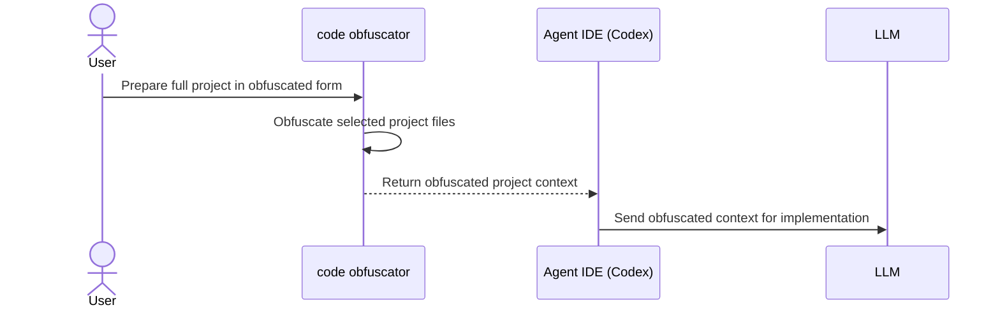
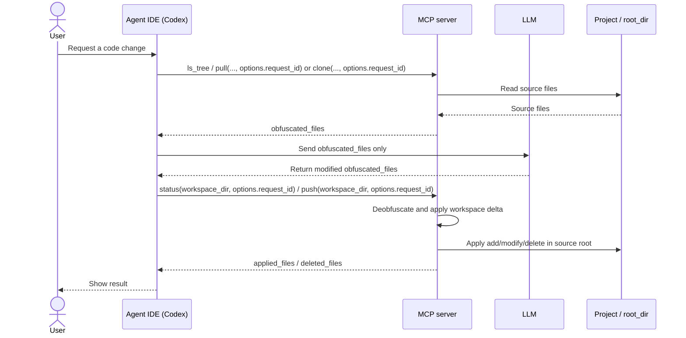

# code-obfuscator

MCP server and CLI/TUI utility for safe code obfuscation before LLM usage and reverse application of LLM changes back to
your project.

## Architecture Diagrams

### code obfuscator case



### MCP Case



## CLI Quick Start

### install

```bash
curl -fsSL https://raw.githubusercontent.com/sawrus/code-obfuscator/main/install | CODE_OBFUSCATOR_INSTALL_REPO=sawrus/code-obfuscator bash
```

Binaries are installed from GitHub
Releases: [sawrus/code-obfuscator/releases](https://github.com/sawrus/code-obfuscator/releases).

### execute

```bash
code-obfuscator
```

## MCP Quick Start

### Build

```bash
make mcp-docker-build
```

### Start the HTTP MCP server

```bash
MCP_HTTP_ADDR=127.0.0.1:18787 \
MCP_LOG_STDOUT=true \
MCP_LOG_MODE=default \
MCP_PROJECTS_HOST_DIR=$HOME/projects \
MCP_DEFAULT_MAPPING_PATH=$HOME/mcp/code-obfuscator/mapping.default.json \
./scripts/run-mcp-docker.sh
```

When `MCP_HTTP_ADDR` is set, `./scripts/run-mcp-docker.sh` starts the container in HTTP-only mode.
Use it as a standalone server launcher, then register Codex by URL. Do not point a stdio MCP config at this script.

Readable MCP logs are enabled by `MCP_LOG_STDOUT=true`:
- `http`: logs are printed to container `stdout`
- `stdio`: logs are printed to `stderr` so MCP framing on `stdout` stays intact
- all transports also write the same readable format to `logs/mcp-server.log`

`MCP_LOG_MODE` controls verbosity:
- `deep`: full request/response bodies
- `default`: readable request/response bodies with file content redacted
- `system`: lifecycle, health, and error logs only

Every MCP operational error logs a full backtrace before the server returns an error response or terminates.

### Register the HTTP endpoint in Codex

```bash
codex mcp remove code_obfuscator >/dev/null 2>&1 || true
codex mcp add code_obfuscator --url http://127.0.0.1:18787/mcp
```

For `http`, Codex connects to the already running endpoint. Unlike `stdio`, Codex does not start the server for you.

### Register the HTTP endpoint in other Agent IDEs

#### OpenCode (example)

```bash
opencode mcp remove code_obfuscator >/dev/null 2>&1 || true
opencode mcp add code_obfuscator --url http://127.0.0.1:18787/mcp
```

#### Antigravity (example)

```bash
antigravity mcp remove code_obfuscator >/dev/null 2>&1 || true
antigravity mcp add code_obfuscator --url http://127.0.0.1:18787/mcp
```

#### Gemini (connector/bridge JSON example)

```json
{
  "name": "code_obfuscator",
  "transport": "http",
  "url": "http://127.0.0.1:18787/mcp",
  "tools_allowlist": ["ls_tree", "ls_files", "pull", "clone", "status", "push"]
}
```

#### Claude (connector JSON example)

```json
{
  "name": "code_obfuscator",
  "transport": "http",
  "url": "http://127.0.0.1:18787/mcp",
  "tools_allowlist": ["ls_tree", "ls_files", "pull", "clone", "status", "push"]
}
```

#### KiloCode (example)

```bash
kilocode mcp remove code_obfuscator >/dev/null 2>&1 || true
kilocode mcp add code_obfuscator --url http://127.0.0.1:18787/mcp
```

`MCP_PROJECTS_HOST_DIR` maps to `-v "<ABS_PATH>:/workspace/projects:rw"` inside Docker.

### Health Check

```bash
curl -i http://127.0.0.1:18787/health
```

### Prompt Sample for MCP

```text
Work only through the MCP code_obfuscator. Your task is to locate a project whose runtime path within /workspace/projects/x/y contains z-api, then read the file query_v2.py from that project and output all SQL scripts stored in it.
```

## Detailed Documentation

- Full documentation (install lifecycle, CLI/TUI modes, MCP integrations, architecture,
  troubleshooting): [docs/DETAILS.md](docs/DETAILS.md)
- Security and performance: [docs/SECURITY_AND_PERFORMANCE.md](docs/SECURITY_AND_PERFORMANCE.md)
- Samples: [docs/SAMPLES.md](docs/SAMPLES.md)
- MCP server plan: [docs/MCP_TOOLS.md](docs/MCP_TOOLS.md)

## `.gitignore` behavior

- CLI and MCP project scans respect rules from `<project-root>/.gitignore`.
- In MCP listing tools, `include_hidden` controls only dot-prefixed paths; `.gitignore` filters are still active.
- MCP `pull` with explicit `file_paths` silently skips paths ignored by root `.gitignore`.

## Development

```bash
make build
make test
```
