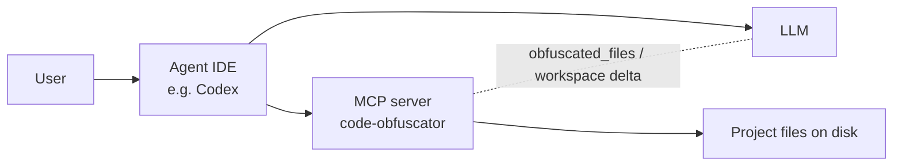
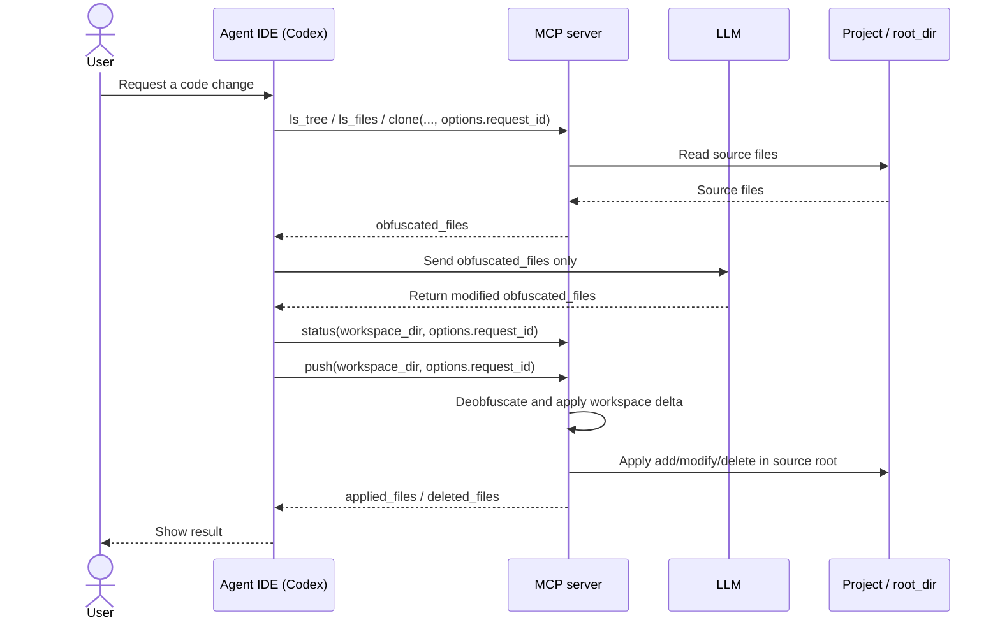

# code-obfuscator

MCP server and CLI/TUI utility for safe code obfuscation before sending code to an LLM, and safe reverse-application of
model output back to your project.

## CLI Installation

### Installed CLI lifecycle

This repository ships a single installer entrypoint: `./install`.
It supports installing from source, from a local binary, from a local release archive, or by downloading a versioned
release bundle.

Supported modes:

- `./install --from-source` - build from the current checkout and install
- `./install --binary ./target/release/code-obfuscator` - install from a local binary
- `./install --archive ./dist/code-obfuscator-linux-x64.tar.gz --version 0.5.0` - install from a local release archive
- `./install --version 0.5.0` - download and install a specific release (when release source is configured)

Default installer-managed paths:

- install home: `~/.code-obfuscator`
- user-local bin (Linux/macOS): `~/.local/bin/code-obfuscator`
- user-local bin (Windows): `%LOCALAPPDATA%\Programs\code-obfuscator\bin\code-obfuscator.exe`

### Local install from repository checkout

macOS / Linux:

```bash
make build
make install
# or
./install --from-source
# or
bash scripts/install.sh --from-source
```

Windows PowerShell:

```powershell
./scripts/install.ps1 -FromSource
```

### Install from an already built local binary

```bash
cargo build --release --bin code-obfuscator
./install --binary ./target/release/code-obfuscator
```

### Install via `curl` + GitHub Releases

Main one-liner:

```bash
curl -fsSL https://raw.githubusercontent.com/sawrus/code-obfuscator/main/install | CODE_OBFUSCATOR_INSTALL_REPO=sawrus/code-obfuscator bash
```

Install a specific version:

```bash
curl -fsSL https://raw.githubusercontent.com/sawrus/code-obfuscator/main/install | CODE_OBFUSCATOR_INSTALL_REPO=sawrus/code-obfuscator bash -s -- --version 0.5.0
```

Release binaries source:

- [sawrus/code-obfuscator/releases](https://github.com/sawrus/code-obfuscator/releases)

### Release bundle lifecycle

`make release-artifacts` packages release binaries into archive names expected by the installer:

- `code-obfuscator-linux-x64.tar.gz`
- `code-obfuscator-linux-arm64.tar.gz`
- `code-obfuscator-darwin-x64.tar.gz`
- `code-obfuscator-darwin-arm64.tar.gz`
- `code-obfuscator-windows-x64.zip`

Installer download source options:

- `CODE_OBFUSCATOR_INSTALL_REPO=owner/repo` for GitHub Releases
- `CODE_OBFUSCATOR_INSTALL_BASE_URL=https://host/path` for a custom release mirror

Examples:

```bash
CODE_OBFUSCATOR_INSTALL_REPO=owner/code-obfuscator ./install --version 0.5.0
CODE_OBFUSCATOR_INSTALL_BASE_URL=https://example.com/code-obfuscator/releases ./install --version 0.5.0
```

By default, the installer attempts to add the user-local bin directory to your shell PATH.
Disable that behavior with `--no-modify-path`.

## Architecture





The IDE is the orchestrator: it calls MCP tools, keeps one `request_id` across clone/status/push, and applies workspace
delta through `push`.

## Tool contracts (brief)

### `ls_tree`

- Input: `root_dir`, `max_depth?`, `max_entries?`, `include_hidden?`
- Output: `entries[{path,kind}]`, `truncated`

### `ls_files`

- Input: `root_dir`, `max_entries?`, `include_hidden?`
- Output: `files[]`, `truncated`

### `pull`

- Input: `root_dir`, `file_paths?`, `options?` with `request_id`
- Output: `obfuscated_files`, `stats`, `events`

### `clone`

- Input: `root_dir`, `workspace_dir`, `options?` with `request_id`
- Output: `cloned_files`, `stats`, `events`

### `status`

- Input: `workspace_dir`, `options?` with `request_id`
- Output: `clean`, `diff{added,modified,deleted}`, `mapping_state`

### `push`

- Input: `workspace_dir`, `options?` with `request_id`
- Output: `applied_files`, `deleted_files`, `stats`, `events`

## HTTP endpoints

- `GET /health`
- `GET /mapping`
- `PUT /mapping`
- `POST /` (MCP JSON-RPC)
- `POST /mcp` (MCP JSON-RPC alias)

## Main environment variables

- `MCP_DEFAULT_MAPPING_PATH`
- `MCP_HTTP_ADDR`
- `MCP_LOG_DIR`
- `MCP_LOG_MAX_BYTES`
- `MCP_LOG_MAX_FILES`
- `MCP_LOG_STDOUT`

## CLI and TUI modes

### Non-interactive CLI

Batch mode remains available via explicit flags:

```bash
code-obfuscator \
  --mode forward \
  --source ./project-src \
  --target ./project-obf \
  --mapping ./mapping.json
```

Deep mode can run without an explicit mapping file:

```bash
code-obfuscator \
  --mode forward \
  --source ./project-src \
  --target ./project-obf \
  --deep
```

Reverse mode auto-detects `mapping.generated.json` in `--source` by default (explicit `--mapping` has priority):

```bash
code-obfuscator \
  --mode reverse \
  --source ./project-obf \
  --target ./project-restored
```

### Interactive TUI

`code-obfuscator` now starts the interactive flow by default when no non-interactive flags are provided.

```bash
code-obfuscator
# explicit flag (same behavior)
code-obfuscator --tui
```

The TUI prompts for mode (`forward`/`reverse`), source and target paths, deep mode, mapping selection, and optional
Ollama/seed settings.

## User config and default mapping

The tool stores user mapping in the application config directory and uses it as default for `forward` mode when
`--mapping` is not provided.

Platform paths:

- Linux: `$XDG_CONFIG_HOME/code-obfuscator/mapping.json` or `~/.config/code-obfuscator/mapping.json`
- macOS: `~/Library/Application Support/code-obfuscator/mapping.json`
- Windows: `%APPDATA%\code-obfuscator\mapping.json`

Mapping source priority:

1. Explicit `--mapping`
2. User config mapping
3. For `reverse`, auto-detected `mapping.generated.json` inside `--source`

If `forward` is started with explicit `--mapping`, that mapping is also persisted as the new user default.

## CLI quick start

1. Prepare mapping (optional but recommended):

```json
{
  "business_secret": "bs"
}
```

2. Build CLI:

```bash
make build
# or
cargo build --bin code-obfuscator
```

3. Obfuscate:

```bash
./target/debug/code-obfuscator \
  --mode forward \
  --source ./test-projects/input \
  --target ./tmp/obf \
  --mapping ./test-projects/mapping.json
```

4. Restore:

```bash
./target/debug/code-obfuscator \
  --mode reverse \
  --source ./tmp/obf \
  --target ./tmp/restored
```

## Current MCP tool model

By default, the server exposes:

- `ls_tree`
- `ls_files`
- `pull`
- `clone`
- `status`
- `push`

Legacy direct deobfuscation tools are removed.

## MCP quick start

1. Prepare mapping (optional but recommended):

```json
{
  "business_secret": "bs"
}
```

2. Build MCP server:

```bash
cargo build --bin mcp-server
# or
make mcp-docker-build
```

3. Start MCP over HTTP:

```bash
MCP_HTTP_ADDR=127.0.0.1:18787 \
MCP_DEFAULT_MAPPING_PATH=./mapping.default.json \
./scripts/run-mcp-docker.sh
```

4. Verify:

```bash
curl -i http://127.0.0.1:18787/health
curl -i http://127.0.0.1:18787/mapping
```

## MCP integration in agent IDEs

All IDE examples below use one canonical Docker runtime pattern (synchronized with `test/mcp_configure.sh`).
Only the config file format differs by IDE.

### Canonical Docker template

Transport: `stdio`

```bash
docker run --rm -i \
  -e MCP_DEFAULT_MAPPING_PATH=/data/mapping.default.json \
  -e MCP_LOG_STDOUT=false \
  -v /ABS/PATH/mapping.default.json:/data/mapping.default.json:ro \
  -v /ABS/PATH/projects:/workspace/projects:rw \
  code-obfuscator-mcp:local
```

Important for all IDEs:

- Mount mapping as read-only: `/ABS/PATH/mapping.default.json:/data/mapping.default.json:ro`
- Mount projects as read-write: `/ABS/PATH/projects:/workspace/projects:rw`
- In MCP calls, `root_dir` must be an in-container path (for example `/workspace/projects/my-project`), not a host path
  like `/Users/...` or `/home/...`
- If you use `push`, the project mount must stay `:rw`

### Codex

Transport: `stdio`

`~/.codex/config.toml`:

```toml
[mcp_servers.code_obfuscator]
enabled = true
command = "docker"
args = [
    "run", "--rm", "-i",
    "-e", "MCP_DEFAULT_MAPPING_PATH=/data/mapping.default.json",
    "-e", "MCP_LOG_STDOUT=false",
    "-v", "/ABS/PATH/mapping.default.json:/data/mapping.default.json:ro",
    "-v", "/ABS/PATH/projects:/workspace/projects:rw",
    "code-obfuscator-mcp:local"
]
```

### Cursor

Transport: `stdio`

`~/.cursor/mcp.json`:

```json
{
  "mcpServers": {
    "code_obfuscator": {
      "command": "docker",
      "args": [
        "run",
        "--rm",
        "-i",
        "-e",
        "MCP_DEFAULT_MAPPING_PATH=/data/mapping.default.json",
        "-e",
        "MCP_LOG_STDOUT=false",
        "-v",
        "/ABS/PATH/mapping.default.json:/data/mapping.default.json:ro",
        "-v",
        "/ABS/PATH/projects:/workspace/projects:rw",
        "code-obfuscator-mcp:local"
      ]
    }
  }
}
```

### Claude Code

Transport: `stdio`

`.mcp.json` (or `claude mcp add-json` payload):

```json
{
  "mcpServers": {
    "code_obfuscator": {
      "command": "docker",
      "args": [
        "run",
        "--rm",
        "-i",
        "-e",
        "MCP_DEFAULT_MAPPING_PATH=/data/mapping.default.json",
        "-e",
        "MCP_LOG_STDOUT=false",
        "-v",
        "/ABS/PATH/mapping.default.json:/data/mapping.default.json:ro",
        "-v",
        "/ABS/PATH/projects:/workspace/projects:rw",
        "code-obfuscator-mcp:local"
      ]
    }
  }
}
```

### VS Code / GitHub Copilot Agent Mode

Transport: `stdio`

`.vscode/mcp.json`:

```json
{
  "servers": {
    "code_obfuscator": {
      "type": "stdio",
      "command": "docker",
      "args": [
        "run",
        "--rm",
        "-i",
        "-e",
        "MCP_DEFAULT_MAPPING_PATH=/data/mapping.default.json",
        "-e",
        "MCP_LOG_STDOUT=false",
        "-v",
        "/ABS/PATH/mapping.default.json:/data/mapping.default.json:ro",
        "-v",
        "/ABS/PATH/projects:/workspace/projects:rw",
        "code-obfuscator-mcp:local"
      ]
    }
  }
}
```

## Codex connection options

### Option 1: HTTP

```toml
[mcp_servers.code_obfuscator]
enabled = true
url = "http://127.0.0.1:18787"
```

### Option 2: stdio + Docker

Use the canonical Docker template from "MCP integration in agent IDEs" and adapt only the config file format.

## Recommended MCP workflow with LLM

1. Inspect source structure with `ls_tree` / `ls_files`.
2. Use `clone(root_dir, workspace_dir, options.request_id)` (or `pull` for payload-only mode).
3. Edit only obfuscated files in workspace.
4. Run `status(workspace_dir, options.request_id)` to inspect delta.
5. Run `push(workspace_dir, options.request_id)` to apply add/modify/delete back to source root.

## Common errors and recovery

- `fail-fast: obfuscated token ... is missing in LLM output for file ...`
    - The model removed or changed an obfuscated token. Re-run the edit and preserve obfuscated tokens.
- `unknown request_id: ...`
    - Start with `clone` or `pull` and reuse the same `options.request_id` for `status`/`push`.
- `root_dir is not writable for push ... Mount the project volume as :rw`
    - Project Docker volume is mounted read-only. Mount it as `:rw` for apply operations.

## Development

```bash
make build
make test
cargo test --test mcp_server
make e2e-blackbox
```

## Blackbox smoke test

`make e2e-blackbox` runs on-demand Codex blackbox scenarios and is not included in `make test`.

Scenario steps:

1. Builds a fresh MCP Docker image via `make mcp-docker-build`.
2. Stages a fixture project under `/workspace/projects/.../api-x-api/query.py` with three SQL blocks.
3. Reconfigures Codex MCP via `test/mcp_configure.sh` for two transports: `stdio` and `http`.
4. Runs `codex exec` twice with prompt from `test/prompt_extract_sql.txt`.
5. Verifies that both runs return the exact extracted SQL blocks from `test/query_api-x_expected.txt`.

## Prompt templates

General prompt templates are in `test/prompt_general.md`.
The blackbox extraction fixture prompt is in `test/prompt_extract_sql.txt`.
